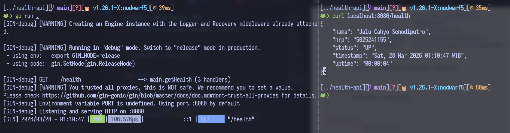
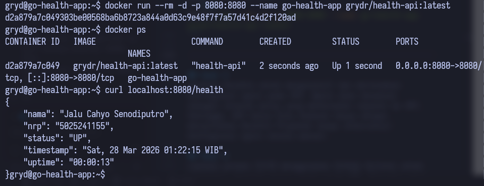
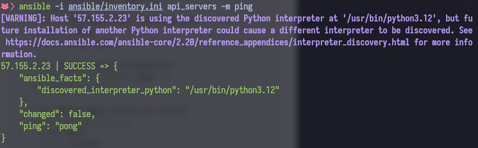
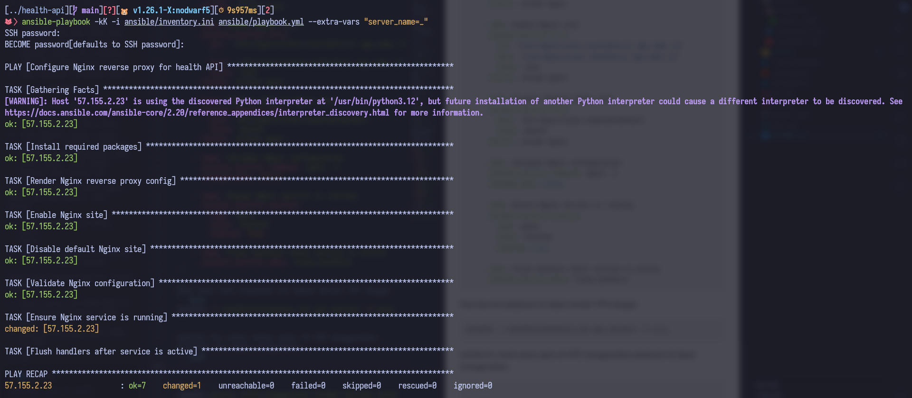
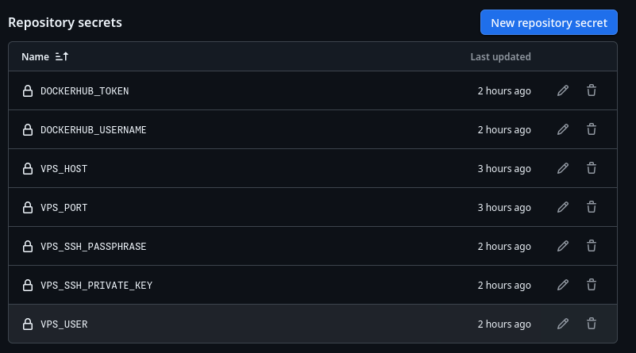
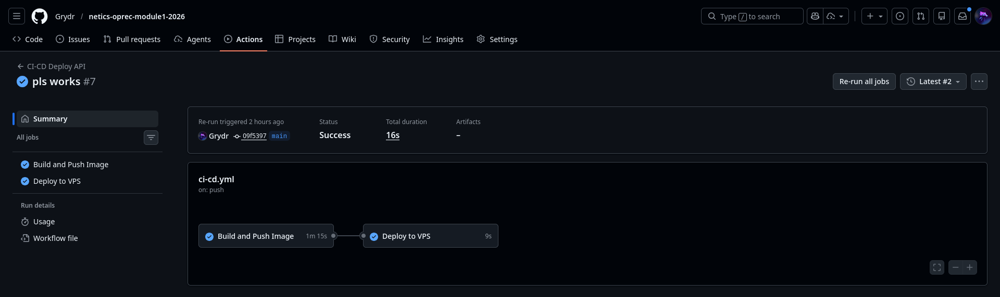

# Modul 1 Oprec Netics 2026

> **Nama:** Jalu Cahyo Senodiputro
> **NRP:** 5025241155

> **Deployed VPS IP:** http://57.155.2.23/health
> **Docker Image:** https://hub.docker.com/repository/docker/grydr/health-api/general

## Soal 1
Buatlah API publik dengan endpoint /health yang menampilkan informasi sebagai berikut:
```json
{
  "nama": "Sersan Mirai Afrizal",
  "nrp": "5025241999",
  "status": "UP",
  “timestamp”: time	// Current time
  "uptime": time		// Server uptime
}
```

Disini saya mengimplementasikan REST API menggunakan Framework Gin dengan bahasa Golang
```go
package main

import (
	"fmt"
	"log"
	"net/http"
	"time"

	"github.com/gin-gonic/gin"
)

var startTime time.Time

func formatUptime(d time.Duration) string {
	hours := int(d.Hours())
	minutes := int(d.Minutes())
	seconds := int(d.Seconds())

	return fmt.Sprintf("%02d:%02d:%02d", hours, minutes, seconds)
}

func formatTimestamp(t time.Time) string {
    return t.Format(time.RFC1123)
}

func formatStatus(status bool) string {
	if status {
		return "UP"
	} else {
		return "DOWN"
	}
}

func getHealth(c *gin.Context) {
	response := gin.H{
		"nama":      "Jalu Cahyo Senodiputro",
		"nrp":       "5025241155",
		"status":    formatStatus(true),
		"timestamp": formatTimestamp(time.Now()),
		"uptime":    formatUptime(time.Since(startTime)),
	}

	c.IndentedJSON(http.StatusOK, response)
}

func init() {
	startTime = time.Now()
}

func main() {
	r := gin.Default()

	r.GET("/health", getHealth)

	if err := r.Run(); err != nil {
		log.Fatalf("failed to run server: %v", err)
	}
}
```

jika kita jalankan menggunakan `go get download` & `go run .` maka kita bisa tes dengan command:
```bash
curl localhost:8080/health
```
dan mendapat hasil
```json
{
    "nama": "Jalu Cahyo Senodiputro",
    "nrp": "5025241155",
    "status": "UP",
    "timestamp": "Sat, 28 Mar 2026 01:10:47 WIB",
    "uptime": "00:00:04"
}
```



## Soal 2
Lakukan deployment API tersebut di dalam container pada VPS publik. Gunakan port selain 80 dan 443 untuk menjalankan API.

> IP VPS: 57.155.2.23
> PORT: 8080

Buat Dockerfile untuk membuat docker image yang bisa di push ke Docker Hub
```Dockerfile
FROM golang:1.26.1

WORKDIR /usr/src/app

RUN apt-get update \
	&& apt-get install -y --no-install-recommends tzdata \
	&& rm -rf /var/lib/apt/lists/*

ENV TZ=Asia/Jakarta
RUN ln -snf /usr/share/zoneinfo/$TZ /etc/localtime && echo $TZ > /etc/timezone

COPY go.mod go.sum ./
RUN go mod download

COPY . .
RUN go build -v -o /usr/local/bin/health-api ./

ENV GIN_MODE=release
EXPOSE 8080

CMD ["health-api"]

```
Lalu kita build docker imagenya
```bash
docker build -t grydr/health-api .
```

Untuk push image ke Docker Hub bisa dengan
```bash
docker login -u <USERNAME> -p <PASSWORD>
docker push grydr/health-api
```

lalu dari dalam VPS bisa pull image dari Docker Hub:
```bash
docker pull grydr/health-api
```

Terakhir kita tinggal mencoba run container dari image yang barusan di pull
```bash
docker run --rm -d -p 8080:8080 --name go-health-app grydr/health-api:latest
```



## Soal 3
Gunakan Ansible untuk menginstall dan meletakkan konfigurasi nginx pada VPS. Nginx akan berperan sebagai reverse proxy yang meneruskan request ke API. Sehingga, API harus bisa diakses hanya dengan menjalankan Ansible Playbook tanpa intervensi/konfigurasi nginx secara manual.

Hal yang perlu disiapkan adalah:
1. templates/nginx.conf # untuk konfigurasi reverse-proxy nginx
```nginx
server {
    listen 80;
    listen [::]:80;
    server_name {{ server_name }};

    location / {
        proxy_pass http://{{ api_upstream_host }}:{{ app_port }};
        proxy_http_version 1.1;

        proxy_set_header Host $host;
        proxy_set_header X-Real-IP $remote_addr;
        proxy_set_header X-Forwarded-For $proxy_add_x_forwarded_for;
        proxy_set_header X-Forwarded-Proto $scheme;

        proxy_connect_timeout 60s;
        proxy_send_timeout 60s;
        proxy_read_timeout 60s;
    }
}
```

2. inventory.ini # untuk koneksi dengan vps
```ini
[api_servers]
57.155.2.23 ansible_user=gryd ansible_port=22
```

kita membuat Ansible Playbook yang berguna untuk:
1. Menginstall nginx
2. Men-copy config nginx dari `templates/nginx.conf` ke
3. Memastikan site kita berjalan
4. Validasi config nginx
5. Memastikan nginx running
```yaml
---
- name: Configure Nginx reverse proxy for health API
  hosts: api_servers
  become: true
  vars:
    app_name: health-api
    app_port: 8080
    api_upstream_host: "127.0.0.1"
    server_name: "{{ server_name | default('_') }}"

  handlers:
    - name: reload nginx
      ansible.builtin.service:
        name: nginx
        state: restarted

  tasks:
    - name: Install required packages
      ansible.builtin.apt:
        name:
          - nginx
          - ca-certificates
        state: present
        update_cache: true
        cache_valid_time: 3600

    - name: Render Nginx reverse proxy config
      ansible.builtin.template:
        src: templates/nginx.conf
        dest: "/etc/nginx/sites-available/{{ app_name }}"
        mode: "0644"
      notify: reload nginx

    - name: Enable Nginx site
      ansible.builtin.file:
        src: "/etc/nginx/sites-available/{{ app_name }}"
        dest: "/etc/nginx/sites-enabled/{{ app_name }}"
        state: link
      notify: reload nginx

    - name: Disable default Nginx site
      ansible.builtin.file:
        path: /etc/nginx/sites-enabled/default
        state: absent
      notify: reload nginx

    - name: Validate Nginx configuration
      ansible.builtin.command: nginx -t
      changed_when: false

    - name: Ensure Nginx service is running
      ansible.builtin.service:
        name: nginx
        state: started
        enabled: true

    - name: Flush handlers after service is active
      ansible.builtin.meta: flush_handlers
```

Kita bisa test playbook ini dapat meraih VPS dengan
```bash
ansible -i ansible/inventory.ini api_servers -m ping
```


setelah itu untuk setup nginx di VPS menggunakan playbook ini dapat menggunakan
```bash
ansible-playbook -kK -i ansible/inventory.ini ansible/playbook.yml --extra-vars "server_name=_"
```



## Soal 4
Lakukan proses CI/CD menggunakan GitHub Actions untuk melakukan otomasi proses deployment API. Terapkan juga best practices untuk menjaga kualitas environment CI/CD.

Kita bisa membuat *workflows* di dalam directory `.github/workflows`

Sebelum itu kita perlu setup beberapa *Secrets* yang akan digunakan pada *workflows* nanti:
- *DOCKERHUB_TOKEN*: API token dari Docker Hub
- *DOCKERHUB_USERNAME*: Username Docker Hub
- *VPS_HOST*: IP Address VPS
- *VPS_PORT*: Port SSH VPS
- *VPS_SSH_PASSPHRASE*: Password SSH key
- *VPS_SSH_PRIVATE_KEY*: Private Key SSH
- *VPS_USER*: Username VPS




```yaml
name: CI-CD Deploy API

on:
  push:
    branches:
      - main
  workflow_dispatch:

concurrency:
  group: ci-cd-${{ github.ref }}
  cancel-in-progress: true

jobs:
  build_and_push:
    name: Build and Push Image
    runs-on: ubuntu-latest
    timeout-minutes: 20
    permissions:
      contents: read

    steps:
      - name: Checkout source
        uses: actions/checkout@v5
        with:
          persist-credentials: false

      - name: Login to Docker Hub
        uses: docker/login-action@v4
        with:
          username: ${{ secrets.DOCKERHUB_USERNAME }}
          password: ${{ secrets.DOCKERHUB_TOKEN }}

      - name: Build and push image
        uses: docker/build-push-action@v4
        with:
          context: .
          file: ./Dockerfile
          push: true
          tags: ${{ secrets.DOCKERHUB_USERNAME }}/health-api:latest

  deploy:
    name: Deploy to VPS
    runs-on: ubuntu-latest
    needs: build_and_push
    timeout-minutes: 20
    environment:
      name: production
    permissions:
      contents: read

    steps:
      - name: Deploy API container via SSH Action
        uses: appleboy/ssh-action@v1.2.0
        env:
          DOCKERHUB_USERNAME: ${{ secrets.DOCKERHUB_USERNAME }}
          DOCKERHUB_TOKEN: ${{ secrets.DOCKERHUB_TOKEN }}
          API_BIND_PORT: ${{ secrets.API_BIND_PORT }}
        with:
          host: ${{ secrets.VPS_HOST }}
          username: ${{ secrets.VPS_USER }}
          key: ${{ secrets.VPS_SSH_PRIVATE_KEY }}
          passphrase: ${{ secrets.VPS_SSH_PASSPHRASE }}
          port: ${{ secrets.VPS_PORT }}
          script_stop: true
          envs: DOCKERHUB_USERNAME,DOCKERHUB_TOKEN,API_BIND_PORT
          script: |
            set -euo pipefail
            if [ -n "$DOCKERHUB_USERNAME" ] && [ -n "$DOCKERHUB_TOKEN" ]; then
              echo "$DOCKERHUB_TOKEN" | docker login --username "$DOCKERHUB_USERNAME" --password-stdin
            fi

              docker pull "$DOCKERHUB_USERNAME/health-api:latest"
              docker rm -f health-api >/dev/null 2>&1 || true
              docker run -d --name health-api --restart unless-stopped \
              -p "127.0.0.1:${API_BIND_PORT:-8080}:8080" \
              "$DOCKERHUB_USERNAME/health-api:latest"
```

*Workflows* ini berfungsi untuk mem-build dan push Docker Image setiap kali ada commit baru di branch **main**, lalu mengupdate Docker Image yang ada di VPS dan me-restart container aplikasi kita



---
### Referensi
- [Setting Up a VPS on Azure](https://www.c-sharpcorner.com/article/setting-up-a-vps-on-azure/)
- [golang - Official Image | Docker Hub](https://hub.docker.com/_/golang)
- [Tutorial: Developing a RESTful API with Go and Gin - The Go Programming Language](https://go.dev/doc/tutorial/web-service-gin)
- [Netics Deployment Module](https://github.com/arsitektur-jaringan-komputer/oprec2026-module-deployment/)
- [Setting Timezones in Docker Containers -](https://technofossy.com/setting-timezones-in-docker-containers/)
- [Setting up a production ready VPS is a lot easier than I thought. - YouTube](https://www.youtube.com/watch?v=F-9KWQByeU0)
- [VSCode Copilot](assets/chat.json)